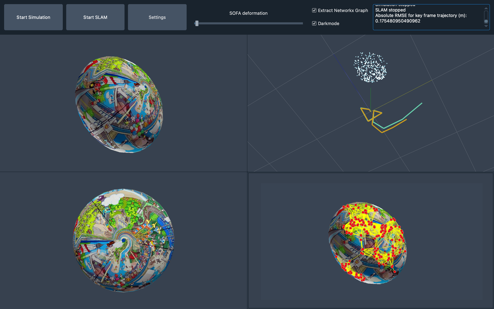

# Model-based SLAM

MobSLAM is a Simultaneous Localization and Mapping system for deformable environments.
This repository contains a graphical user interface that enables 

* the display of a [SOFA simulation](https://www.sofa-framework.org)
* different options to record and select different paths as well as a keyboard controller for the simulation camera
* different options to deform the simulated object
* use of a Simultaneous Localization and Mapping (SLAM) algorithm to 
	1. track the camera movement within the simulation 
	1. generate a map of the scene
	1. incorporate deformation information based on a parallel simulation

It is designed to be modular and easily extensible and aims at providing a reliable and replicable code base for future work on this topic.

The model-based approach enables the SLAM algorithm to produce good results even in the presence of deformations e.g. caused by external forces or changes in volume.
The aim of this work is to provide a more reliable geometric representation of deformable structures based on a monocular camera by directly incorporating information about the deformation into the mapping.

The basic idea is to run a parallel FEM simulation predicting the deformation based on measurements and then use the simulated surface information, i.e. vertex positions, to continuously update the SLAM results.
At this stage there is no distinction between the "real world" and the simulation which basically corresponds to perfect predictions of the deformation.
This is obviously almost impossible to achieve in real life which is why the interface is designed to easily separate between the two views - more information on this can be found below.
This repository was created as part of the research area B1 concerning [Intraoperative Navigation of Multimodal sensors](https://www.grk2543.uni-stuttgart.de/en/research/b-modeling-and-classification/b1-modeling/) of the [RTG 2543: Intraoperative Multisensory Tissue Differentiation in Oncology](https://www.grk2543.uni-stuttgart.de/en/) at the [Institute for System Dynamics (ISYS)](https://www.isys.uni-stuttgart.de/en/), University of Stuttgart, Germany.
The corresponding thesis that provides the theoretical foundation for this project and was written during the development phase, can be found in the subfolder `docs/thesis`.

It builds on top of [QSofaGLViewTools](https://github.com/psomers3/QSofaGLViewTools) and [MATLAB Monocular Visual Simultaneous Localization and Mapping](https://www.mathworks.com/help/vision/ug/monocular-visual-simultaneous-localization-and-mapping.html).

## Repository overview

The source code as well as all relevant information can be found in the `src` folder.
It is split up into:

* the main script `main.py` to run the GUI
* the subfolder `gui` containing
	* `mainwindow.py`: contains all the GUI elements (Widgets, Layouts, interactive elements,...) as well as the SOFA viewer and an instance of `EngineORB`
	* `orb.py`: contains the class that is responsible for transformation and exchange of data between the SLAM (MATLAB) and the SOFA simulation (Python)
	* `plotter.py`: contains functions to plot the results using [pyqtgraph](https://pyqtgraph.readthedocs.io/en/latest/)
* the subfolder `mesh` containing some basic mesh files and texture images that were used for testing
* the subfolder `slam` containing
	* the MATLAB implementation of ORB-SLAM
	* the added functions and scripts for projection and forward prediction based on the simulated deformation, i.e. the core part of the model-based SLAM
* the subfolder `sofaviewer` containing a past version of [psomers3/QSofaGLViewTools](https://github.com/psomers3/QSofaGLViewTools):
	> A small PyQt widget library for viewing SOFA simulation cameras and controlling them.
* the subfolder `feature_graph` which 
	* uses [opencv-python](https://pypi.org/project/opencv-python/) to extract ORB features of the current image
	* creates a [NetworkX](https://networkx.org) graph with the features as nodes and user-setting-based edges
	* displays that graph on top of the image

Please refer to the [homepage](https://pages.github.tik.uni-stuttgart.de/JHaag/Model_based_SLAM/) for more information on contents.
There is also a small introduction available to get going.

## Prerequisites
Versions used for testing in brackets.

1. Python (3.7)
1. [MATLAB](https://www.mathworks.com/products/matlab.html) (2020b)
1. [Sofa](https://www.sofa-framework.org) with Python3 bindings (v20.12)
1. [qtpy](https://pypi.org/project/QtPy/) (1.9.0), [PyQt5](https://pypi.org/project/PyQt5/) (5.15.4)
1. [pyqtgraph](https://pyqtgraph.readthedocs.io/en/latest/) (0.12.1)
1. [NetworkX](https://networkx.org) (2.5.1)
1. [cv2](https://pypi.org/project/opencv-python/) (4.5.2)
1. [qdarkstyle](https://qdarkstylesheet.readthedocs.io/en/latest/) (3.0.2)

## Open issues

Please see the issues section of the GitHub repository for existing issues and bugs that have not be fully resolved yet.
A major bottleneck of the RSE infrastructure is the lack of proper testing, poor error handling, especially between MATLAB and Python, and missing automation regarding CI/GitHub workflows.
Furthermore, checking data types of user inputs, e.g. when using the settings dialog, is an obvious area for potential improvement.