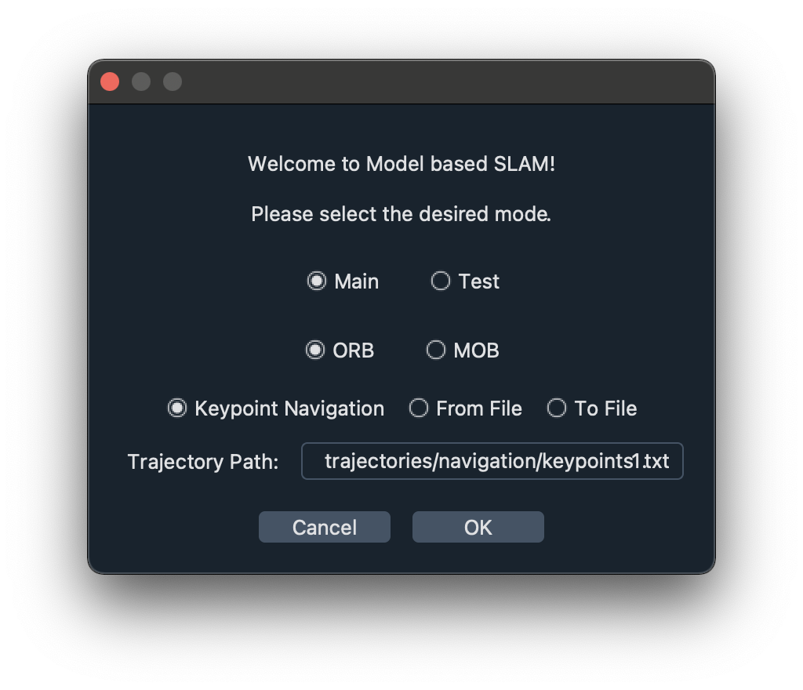

# Get going

To open the GUI, step into the source folder and simply run `main.py`, e.g. via

```bash
# pwd==.../Model_based_SLAM
cd src
python3 main.py
```

or execute the shell script with

```bash
# pwd==.../Model_based_SLAM
./run.sh
```
First a popup dialog will open, allowing you to chose the mode consisting of the GUI layout, SLAM version, and navigation mode.



The two options for the GUI layout are:

* `Main`: the intended final layout consisting of

	* option bar (very top)
	* real world view (top left)
	* simulated view (bottom left)
	* SLAM results plot (top right)
	* feature graph window (bottom right)
	<br/><br/>

	In this mode all the widgets are fixed in space and all the relevant information is visible at all times.

* `Test`: a layout that allow for more user configuration consisting of

	* option bar (very top)
	* real world view (left)
	* SLAM results plot (right, currently in the front)
	* feature graph window (right, in the back)
	<br/><br/>

	This mode was designed specifically for the considered case, that is real world and simulated environment are basically the same.
	Here the two plots on the right are (un)dockable and can be resized and reorganized to some degree.

The two options for the SLAM version refer to the algorithm that is used for the scene reconstruction and position estimation:

* `ORB`: the standard ORB-SLAM implemented in MATLAB
* `MOB`: the Model-based SLAM to keep track of deformations

Note: Keep in mind that the Model-based SLAM, at least at its current stage, is quite slow compared to ORB-SLAM and does not guarantee good results in the presence of large deformations.	

For the navigation mode there are three different options:

* `Keypoint Navigation`: In this case `Trajectory Path` has to link to a `.txt` file containing a set of keypoints that should be part of the trajectory. Each row corresponds to one keypoint where each keypoint consists of
	* a time at which this keypoint has to be reached,
	* a camera position, and
	* a camera orientation.

	The entire trajectory is then computed in advance using linear interpolation to connect the keypoints. 
	Some sample trajectories can be found in `src/trajectories/navigation`.
	This is the default and most user-friendly navigation mode. 

* `From File`: Similar to the keypoint navigation, the camera is also following a predefined trajectory. However in this case `Trajectory path` has to be a directory containing two files:

	* `camera_positions.txt`
	* `camera_orientation.txt`

	These two files contain the entire trajectory, i.e. the position and orientation at each time step and thus have to have the same number of lines/rows.
	The camera position is then set to those values and updated accordingly.
	Some sample trajectories can be found in `src/trajectories/simple` and `src/trajectories/test`.

* `To File`: In contrast to the other two options, this navigation mode enables the user to record a trajectory to use in the future by controlling the camera with the keyboard controls (w-a-s-d and arrow keys).
There two different ways to do this:

	* If `Trajectory path == src/trajectories/navigation`, a keypoint trajectory is being recorded. Maneuver to the desired positions and press `H` to add the current pose to the list of keypoints.
	When the simulation is stopped, the list is written to `src/trajectories/navigation/keypoints_new.txt` and can be used in `Keypoint Navigation` mode from now on.<br/>
	Note: Time steps are being recorded simultaneously. 
	To increase/decrease movement speed, times can be edited manually.

	* For all other `Trajectory Path`s, the camera position and orientation at each time step is recorded and written to the desired directory.
	In this case two files are created (`camera_positions.txt` and `camera_orientation.txt`) which can be used in `From File` mode.

Click `Ok` and the GUI will open.
For details on the different elements visible and their functionalities, please refer to [gui.md](gui.md).

Happy mapping!