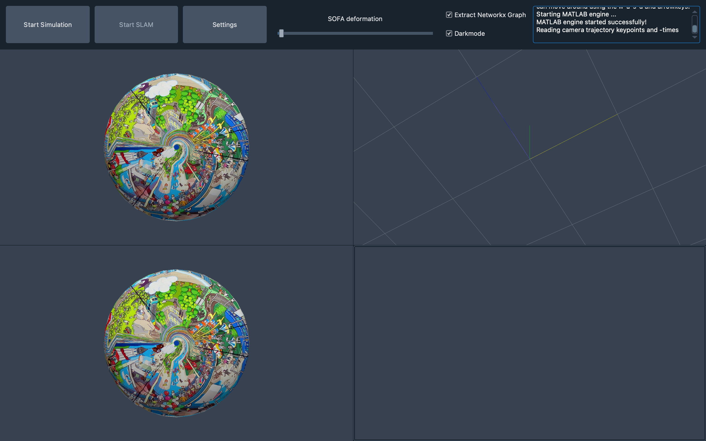
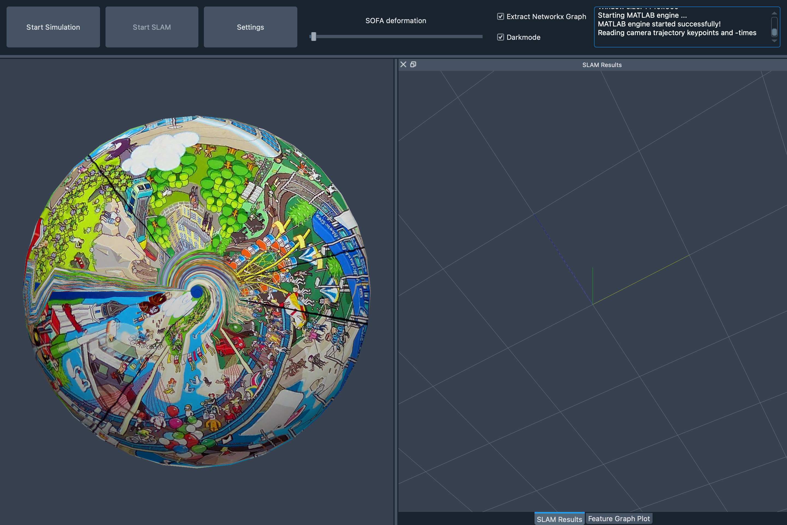
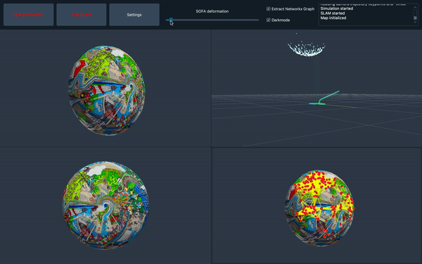

# GUI

## Basic GUI layout

There exist two basic layout modes: `Main` (left) and `Test` (right) that, for the most part, consist of the same elements.
The only real difference is that `Test` doesn't distinguish between the real world view and the simulation view (at least in terms of visualization) and therefore shows the environment only once.

 

## Option Bar

The options bar consists of the following elements:

* **start/stop button** for simulation
* **start/stop button** for SLAM
* **settings button** to open settings dialog (see below)
* **deformation slider** to deform the sofa object
* **graph extraction checkbox** to switch on/turn off the graph extraction as described in [feature_graph.md](feature_graph.md)
* **colortheme checkbox** to switch between light and dark mode
* **text editor** to which the console output (e.g. print statements) is redirected

## Settings dialog

The following values can be set by the user:

* Tab `General/SLAM`:
    * Checkbox to update SLAM view automatically based on current estimated camera positon (not working)
    * Number of simulation steps to run before updating the SLAM again
* Tab `Sofa`:
    * Material properties of the simulated object: young's modulus and poisson ratio
    * flags indicating which parts of the SOFA model to display
* Tab `NetworkX`:
    * Number of ORB features for the graph extraction
    * Maximum distance at which to features are still connected via an edge in the graph
    * Number of simulation steps to run before updating the feature graph again
    * Remark: Please be aware that a large graph (i.e. many features and/or large maximum distance) may affect performance
