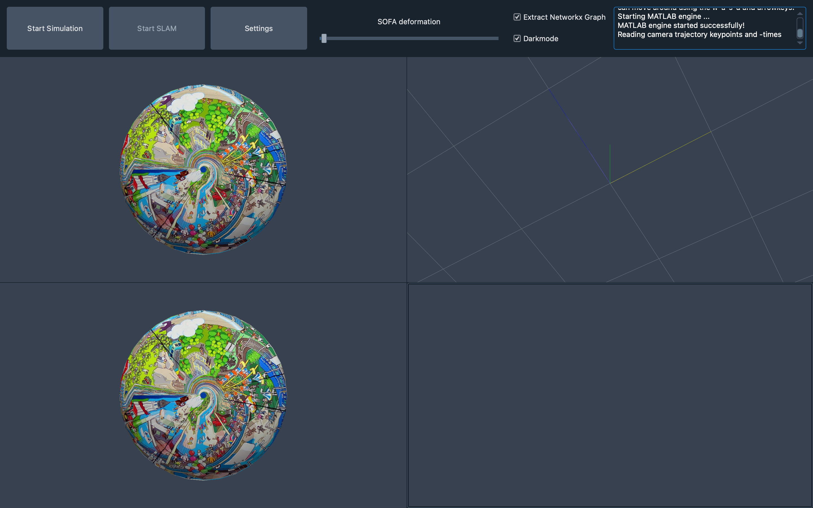
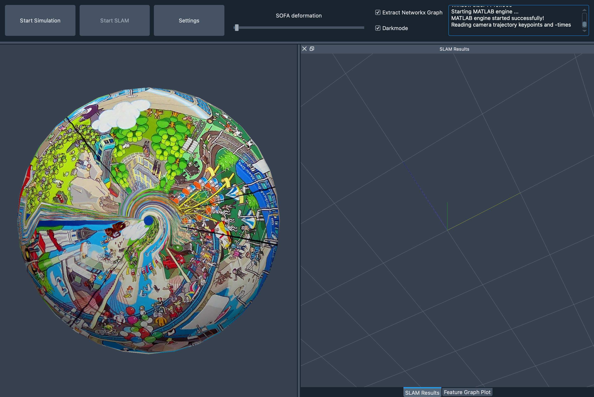

## GUI layout

A | B
- | - 
 | 

### Option Bar

The options bar consists of the following elements:

* **start/stop button** for simulation
* **start/stop button** for SLAM
* **settings button** to open settings dialog (see below)
* **deformation slider** to deform the sofa object
* **graph extraction checkbox** to switch on/turn off the graph extraction as described in [feature_graph.md](feature_graph.md)
* **colortheme checkbox** to switch between light and dark mode
* **text editor** to which the console output (e.g. print statements) is redirected

### Settings dialog

Following values can be set by the user:

* abc

